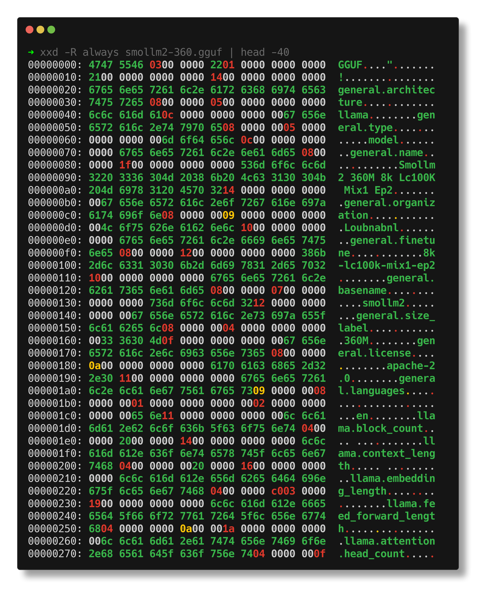

# Open models for AI applications

> [KI-Tage](https://ki-tage.webwirtschaft.net/) Halle (Saale), [Martin
> Czygan](https://de.linkedin.com/in/martin-czygan-58348842), 2025-11-21
> 11:30-13:00 [90min]

## Overview

* talk 10 minutes about the why (and why not)
* have 10 demos (about 5 minutes each) as input, up for discussion; all built with openly available models and run on own hardware
* generic ideas and outlook

## What is an open model?

* an LLM is just a file!

Model availability is not binary, there is a spectrum:

> We propose a framework to assess six levels of access to generative AI
> systems, from [The Gradient of Generative AI Release: Methods and
> Considerations](https://arxiv.org/pdf/2302.04844):

* fully closed
* gradual or staged access
* hosted access
* cloud-based or **API access**
* **downloadable access** and
* **fully open**.

## Why?

* privacy
* control (you reuse the model/file forever)
* LLM is already a black box ...

> In-context learning means language models learning to do new tasks, better
> predict tokens, or generally reduce their loss dur- ing the forward-pass at
> inference-time, without any gradient-based updates to the model’s parameters.

> How does in-context learning work? **While we don’t know for sure**, there
> are some intriguing ideas. -- [Speech and Language Processing, Jurafsky,
> Martin, 08/2025](https://web.stanford.edu/~jurafsky/slp3/ed3book_aug25.pdf)

* after hardware costs, lower cost to run

> on <2k EUR HW, ex. qwen25; 28M tokens/day (prompt eval), 4.3M tokens/day
> (eval; 30+ novels per day); depending on the provider you can pay up to EUR
> 50/day for this kind of throughput (this is a vague calculation, of course)

* customizations
* security research (open models will be used)

## Why not?

* less usable overall ("no instruction following", ...)
* fewer integrations and conveniences
* more expensive to start with
* security (cf. [Security Challenges in AI Agent Deployment: Insights from a
  Large Scale Public Competition](https://arxiv.org/pdf/2507.20526)

## Use case of shared infra

* can share into infra
* example: [chat-ai](https://github.com/gwdg/chat-ai), 700K users;
  [concept](https://kisski.gwdg.de/dok/grundversorgung.pdf) for AI basis
services for a regional scientific community; est. cost EUR 5-10M; for
projected 1M users that would amount to about EUR 5-10 per year per user.

