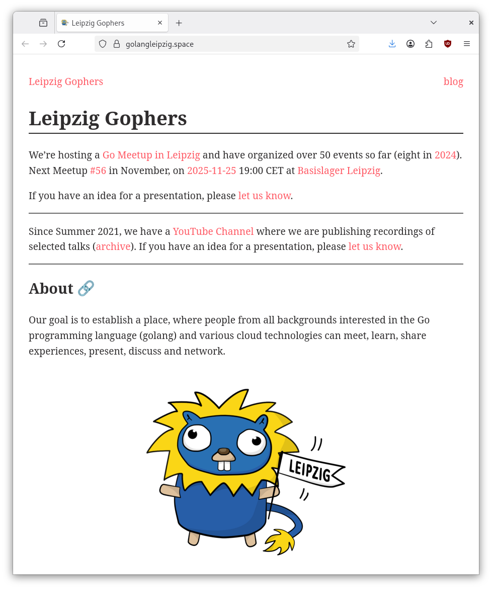
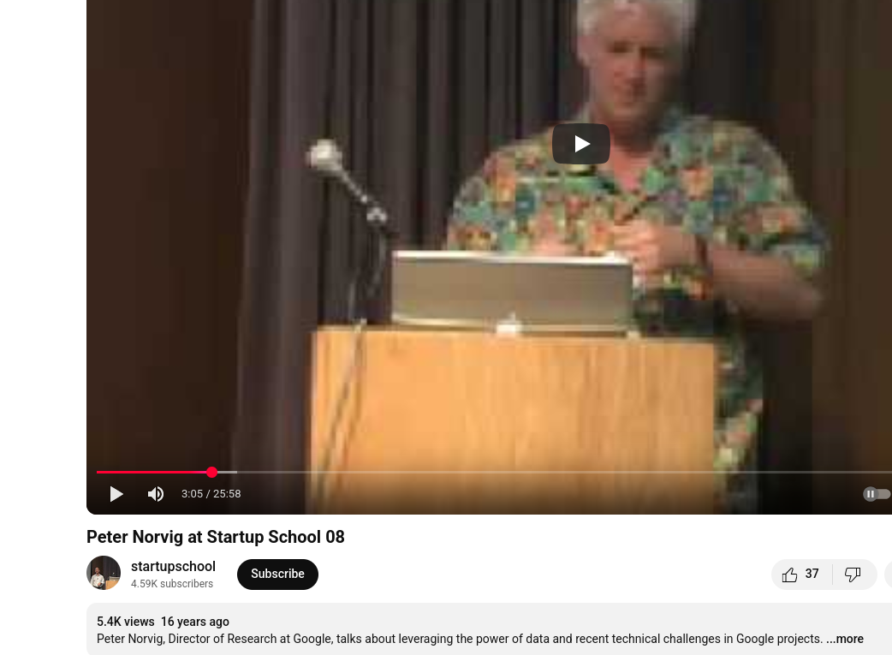
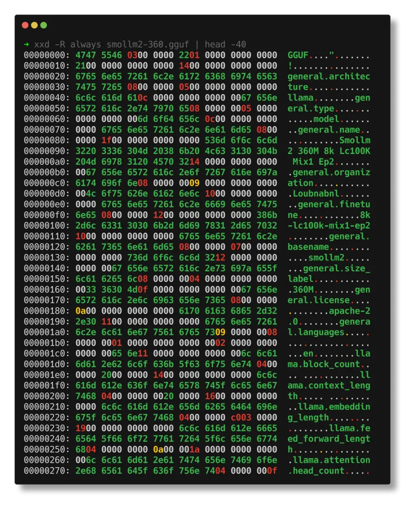
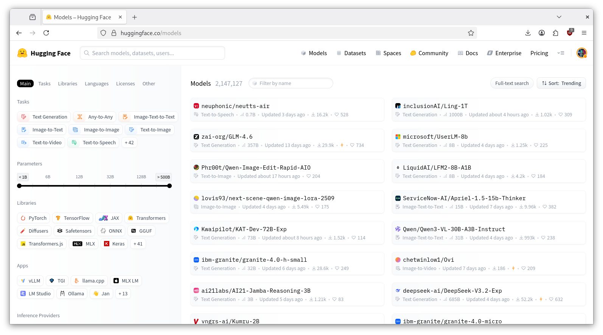
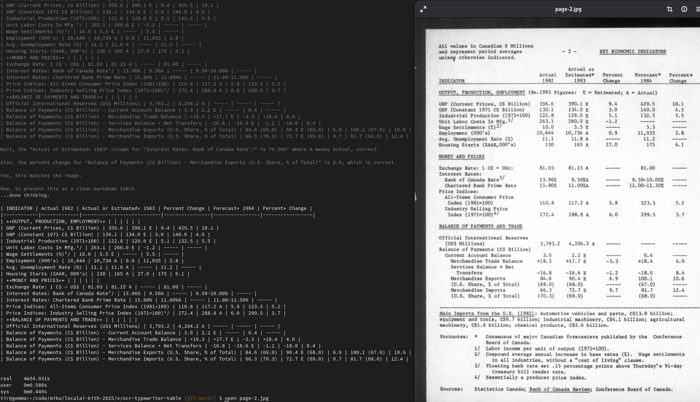

# Open models for AI applications

> [KI-Tage](https://ki-tage.webwirtschaft.net/) Halle (Saale), [Martin Czygan](https://de.linkedin.com/in/martin-czygan-58348842), 2025-11-21
> 11:30-13:00 [90min]

## Overview

* what and why (and why not) of open models [10]
* using open models [20]
* building with open models; with examples, built with open models; templates [30]
* wrap-up and a simple project scaffold [10]

## About me

* software developer, working on projects at [Leipzig University
  Library](https://de.wikipedia.org/wiki/Universit%C3%A4tsbibliothek_Leipzig),
[Internet Archive](https://archive.org)

----

### Quick archive tour

* [quick archive tour](notes/ia.md)

----

* personal AI journey stated with [AI class 2011](https://web.archive.org/web/20110906213406/http://www.ai-class.com/); NLP at UL
* previously also consultant, author, lecturer, [meetup host](https://golangleipzig.space/)

Since 2008 I try to live by the motto:

> "The key here is that no matter how agile you are as coders, [...] data is
> going to be more agile than code. Because you going to write the code
> yourself, but the data you can leverage." -- [Peter Norvig at Startup School
> 2008](https://youtu.be/LNjJTgXujno?si=IweUD5YQlbZ7eTWw&t=185) (5.4K view; I
> watched it a few times!)

## Disclaimer

> I am excited (as anyone) by certain possibilities. But also, there is still a
long way to go for a lot of things people may assume are already solved. CPU
cycles are also still a thing (why use 1B instructions, if 1M could also do).

Recently, read in FAZ (12.11.2025): "Aufgaben wie Texte verfassen, Folien erstellen, Daten
auswerten oder Software schreiben beherrscht die Technologie inzwischen
zuverlässig." -- [KI-Kompetenzen: Worauf es im Job wirklich ankommt](https://www.faz.net/pro/digitalwirtschaft/zukunft-der-arbeit/ki-kompetenzen-worauf-es-im-job-wirklich-ankommt-accg-110768933.html)

> **Views here are my own.**

General questions:

> Jim Covello (Goldman Sachs) in [Global Macro Research, Issue 129,
07/2024](http://web.archive.org/web/20250720040207/https://www.goldmansachs.com/images/migrated/insights/pages/gs-research/gen-ai--too-much-spend%2C-too-little-benefit-/TOM_AI%202.0_ForRedaction.pdf)

> We estimate that the AI infrastructure buildout will cost over **$1tn in the
> next several years alone**, which includes spending on data centers, utilities,
> and applications. So, the crucial question is: **What $1tn problem will AI
> solve?**

> Also in that article: Internet, Web 2.0, Smartphones were all much (relatively)
> cheaper to start with. An e-commerce shop in the late 1990s was not
> significantly more expensive than starting a physical store.

## What is an open model?

* an LLM is just a file!

Or weights as colors (cutout):

Model availability is not binary, there is a spectrum:

> We propose a framework to assess six levels of access to generative AI
> systems, from [The Gradient of Generative AI Release: Methods and
> Considerations](https://arxiv.org/pdf/2302.04844):

* fully closed
* gradual or staged access
* hosted access
* cloud-based or **API access**
* **downloadable access** and
* **fully open**.

## List of popular open weights models

* [Llama](https://www.llama.com/)
* [Mistral](https://docs.mistral.ai/getting-started/models/models_overview/#open-models)
* [Gemma](https://deepmind.google/models/gemma/)
* [Qwen](https://huggingface.co/Qwen)
* [DeepSeek](https://huggingface.co/deepseek-ai)
* [GPT-OSS](https://en.wikipedia.org/wiki/Products_and_applications_of_OpenAI#GPT-OSS)
* [Apertus](https://de.wikipedia.org/wiki/Apertus)

> Apertus wurde im September 2025 vorgestellt und gilt damit als das erste
> große Sprachmodell aus der Schweiz. Es ist vollständig als Open Source
> verfügbar; auch der Quellcode des Trainingsprozesses sowie die Trainingsdaten
> sind offengelegt. -- [Apertus](https://de.wikipedia.org/wiki/Apertus)

And more, from [List of large language models](https://en.wikipedia.org/wiki/List_of_large_language_models):

|    | Name                | Release date[a]    | Developer    | License[c]           |
|---:|:--------------------|:-------------------|:-------------|:---------------------|
|  0 | GPT-1               | June 2018          | OpenAI       | MIT[4]               |
|  1 | BERT                | October 2018       | Google       | Apache 2.0[7]        |
|  2 | T5                  | October 2019       | Google       | Apache 2.0[12]       |
|  3 | XLNet               | June 2019          | Google       | Apache 2.0[15]       |
|  4 | GPT-2               | February 2019      | OpenAI       | MIT[21]              |
|  5 | GPT-Neo             | March 2021         | EleutherAI   | MIT[27]              |
|  6 | GPT-J               | June 2021          | EleutherAI   | Apache 2.0           |
|  7 | GPT-NeoX            | February 2022      | EleutherAI   | Apache 2.0           |
|  8 | YaLM 100B           | June 2022          | Yandex       | Apache 2.0           |
|  9 | BLOOM               | July 2022          | Large collab | Responsible AI       |
| 10 | Galactica           | November 2022      | Meta         | CC-BY-NC-4.0         |
| 11 | Llama               | February 2023      | Meta AI      | Non-commercial resea |
| 12 | Chameleon           | June 2024          | Meta AI      | Non-commercial resea |
| 13 | Cerebras-GPT        | March 2023         | Cerebras     | Apache 2.0           |
| 14 | Falcon              | March 2023         | Technology I | Apache 2.0[68]       |
| 15 | OpenAssistant[71]   | March 2023         | LAION        | Apache 2.0           |
| 16 | Llama 2             | July 2023          | Meta AI      | Llama 2 license      |
| 17 | Mistral 7B          | September 2023     | Mistral AI   | Apache 2.0           |
| 18 | Grok 1[82]          | November 2023      | xAI          | Apache 2.0           |
| 19 | Mixtral 8x7B        | December 2023      | Mistral AI   | Apache 2.0           |
| 20 | Mixtral 8x22B       | April 2024         | Mistral AI   | Apache 2.0           |
| 21 | DeepSeek-LLM        | November 29, 2023  | DeepSeek     | DeepSeek License     |
| 22 | Phi-2               | December 2023      | Microsoft    | MIT                  |
| 23 | Gemma               | February 2024      | Google DeepM | Gemma Terms of Use[9 |
| 24 | DBRX                | March 2024         | Databricks a | Databricks Open Mode |
| 25 | Fugaku-LLM          | May 2024           | Fujitsu, Tok | Fugaku-LLM Terms of  |
| 26 | Phi-3               | April 2024         | Microsoft    | MIT                  |
| 27 | Granite Code Models | May 2024           | IBM          | Apache 2.0           |
| 28 | Qwen2               | June 2024          | Alibaba Clou | Qwen License         |
| 29 | DeepSeek-V2         | June 2024          | DeepSeek     | DeepSeek License     |
| 30 | Nemotron-4          | June 2024          | Nvidia       | NVIDIA Open Model Li |
| 31 | Llama 3.1           | July 2024          | Meta AI      | Llama 3 license      |
| 32 | Mistral Large       | November 2024      | Mistral AI   | Mistral Research Lic |
| 33 | Pixtral             | November 2024      | Mistral AI   | Mistral Research Lic |
| 34 | DeepSeek-V3         | December 2024      | DeepSeek     | MIT                  |
| 35 | DeepSeek-R1         | January 2025       | DeepSeek     | MIT                  |
| 36 | Qwen2.5             | January 2025       | Alibaba      | Qwen License         |
| 37 | MiniMax-Text-01     | January 2025       | Minimax      | Minimax Model licens |
| 38 | Llama 4             | April 5, 2025      | Meta AI      | Llama 4 license      |
| 39 | Qwen3               | April 2025         | Alibaba Clou | Apache 2.0           |
| 40 | GLM-4.5             | July 29, 2025      | Zhipu AI     | MIT                  |
| 41 | GPT-OSS             | August 5, 2025     | OpenAI       | Apache 2.0           |
| 42 | DeepSeek-V3.1       | August 21, 2025    | DeepSeek     | MIT                  |
| 43 | DeepSeek-V3.2-Exp   | September 29, 2025 | DeepSeek     | MIT                  |
| 44 | GLM-4.6             | September 30, 2025 | Zhipu AI     | Apache 2.0           |

Via: [scripts/scrape-llm-table.py](scripts/scrape-llm-table.py)

And more. The ocean of models and the research landscape is vast.

 (from 10/2023,
[Link](https://www.researchgate.net/figure/A-chronological-overview-of-large-language-models-LLMs-multimodal-and-scientific_fig2_373451304),
from [Examining User-Friendly and Open-Sourced Large GPT Models: A Survey on
Language, Multimodal, and Scientific GPT
Models](https://arxiv.org/abs/2308.14149))

As of 2025-10-13, popular model hosting site huggingface lists 2147127 models.

## Applications

Basic chat application, e.g. desktop, web, mobile that you can run on prem or
on your laptop, etc.

* [LMStudio](https://lmstudio.ai/)
* [ollama](https://ollama.com/)
* [AnythingLLM](https://anythingllm.com/)
* [Nomic GPT4All](https://www.nomic.ai/gpt4all), [Anleitung](https://www.htw-berlin.de/fileadmin/HTW/Zentral/LSC/Formulare/Lokale_Sprachmodelle_mit_GPT4All_nutzen.pdf.pdf)
* [Jan.ai](https://www.jan.ai/)
* [LocalAI](https://localai.io/)
* ...

And many more.

## Why?

* privacy
* control (you reuse the model/file forever)
* LLM is already a black box ...

> In-context learning means language models learning to do new tasks, better
> predict tokens, or generally reduce their loss dur- ing the forward-pass at
> inference-time, without any gradient-based updates to the model’s parameters.

> How does in-context learning work? **While we don’t know for sure**, there
> are some intriguing ideas. -- [Speech and Language Processing, Jurafsky,
> Martin, 08/2025](https://web.stanford.edu/~jurafsky/slp3/ed3book_aug25.pdf)

* after hardware costs, lower cost to run

> on <2k EUR HW, ex. qwen25; 28M tokens/day (prompt eval), 4.3M tokens/day
> (eval; 30+ novels per day); depending on the provider you can pay up to EUR
> 50/day for this kind of throughput (this is a vague calculation, of course)

* customizations
* security research (open models will be used)

## Why not?

* less usable overall ("no instruction following", ...)
* fewer integrations and conveniences
* more expensive to start with
* security (cf. [Security Challenges in AI Agent Deployment: Insights from a
  Large Scale Public Competition](https://arxiv.org/pdf/2507.20526))

## Use case of shared infra

* can share into infra
* example: [chat-ai](https://github.com/gwdg/chat-ai), 700K users;
  [concept](https://kisski.gwdg.de/dok/grundversorgung.pdf) for AI basis
services for a regional scientific community; est. cost EUR 5-10M; for
projected 1M users that would amount to about EUR 5-10 per year per user.

Notes, calculations: [miku/aiexp-25-5](https://github.com/miku/aiexp-25-5)

## Using Open Models

* [x] Download desktop application
* [x] Download model or connect to endpoint
* [x] Done

There are a number of desktop applications:

* [LMStudio](https://lmstudio.ai/)
* [Jan.ai](https://www.jan.ai/)
* [GPT4All](https://www.nomic.ai/gpt4all)
* [AnythingLLM](https://anythingllm.com/)
* [Ollama](https://ollama.com/)
* ...

Notes:

* LMStudio is intuitive, but does not support remote providers (?)
* Jan.AI is relatively lightweight, supports remote models, but lacks RAG (?); assistants can be defined; they have a [handbook](https://www.jan.ai/handbook/why/why-jan-exists)

> Here's a stat that might surprise you: the average knowledge worker spends
> 60% of their time on what researchers call "work about work." Not the actual
> work they were hired to do. The things around it. Searching for information.
> Chasing updates. Switching between apps. Talking about work instead of doing
> it.

* GPT4All, easier rag, single model granularity
* AnythingLLM, complex UI; limited configuration ("by category")
* ollama, started as a cli, UI available for macOS, Windows, only

### Suggestions

Let's try [Jan.ai](https://www.jan.ai/) with some endpoints; our instance types
:)

* `k2s` · using an Intel N150 ("[alder lake](https://en.wikipedia.org/wiki/Alder_Lake)"), **16GB** DDR3 RAM, 6W CPU, [spec](https://www.intel.com/content/www/us/en/products/sku/241636/intel-processor-n150-6m-cache-up-to-3-60-ghz/specifications.html)
* `k2m` · using an nvidia GPU, **20GB** GDDR6, [70W](https://www.nvidia.com/content/dam/en-zz/Solutions/rtx-4000-sff/proviz-rtx-4000-sff-ada-datasheet-2616456-web.pdf)
* `k2l` · using an amd iGPU, up to **128GB** unified LPDDR5x-8000 RAM, 120W, [spec](https://www.amd.com/en/products/processors/laptop/ryzen/ai-300-series/amd-ryzen-ai-max-plus-395.html)

All instances expose an openai [compatible](https://github.com/openai/openai-openapi) endpoint (via ollama 0.12.11), with a variety of [models](notes/k2.md) - the machines live in a private VPN
coordinated by a (tiny) [headscale](https://headscale.net/) node living in a data center in [Falkenstein/Vogtl.](https://de.wikipedia.org/wiki/Falkenstein/Vogtl.)

## A few things to do

Depending on your experience and interest you can install:

* [Jan.ai](https://www.jan.ai/) (cross-platform)
* [ollama](https://ollama.com/) (cli, app available for macOS, Windows)

### General Chat

> LLM, RAG

* install application, install model host (if needed), run chat, RAG, etc.
* research; learning

### Customizations, e.g. via modelfile (ollama)

Akin to different "gpt" flavors. In some projects lot of the "IP" lies in the "prompt".

* [x/custom](x/custom-modelfile/) (writing assistants, support, eliza)

### Model manipulation

* de-censor a model: [ Uncensor any LLM with abliteration ](https://huggingface.co/blog/mlabonne/abliteration)

### License Plate Scan

> image, text

* scan license plate in variable image
* inspiration:
  [Parkhaus](https://www.tagesspiegel.de/berlin/bezirke/1400-parkplatze-am-ice-bahnhof-kunftig-ohne-ticket-ins-parkhaus-der-spandau-arcaden-13433527.html)
("Ohne Ticket") am Berliner Rathaus Spandau

Example: [Automatic-License-Plate-Recognition-using-YOLOv8](https://github.com/Muhammad-Zeerak-Khan/Automatic-License-Plate-Recognition-using-YOLOv8#)

### Image captioning

Augement image material with textual data: [AI exploration 6](https://github.com/miku/aiexp-25-6)

### OCR

Multimodal models like qwen3-vl can extract data from documents quite well.

Another example: [markdown output](https://github.com/miku/aiexp-25-1?tab=readme-ov-file#exp-document-parsing-ocr-htr)

### More OCR

* nice writeup of current models: https://huggingface.co/blog/ocr-open-models

### Structured data extraction

* [GROBID](https://github.com/kermitt2/grobid) turns PDFs to TEI XML (various clients, including one in [go](https://github.com/miku/grobidclient))
* basis for citation graph

Workflow for citation graph:

* [x] gather data
* [x] extract structured output
* [x] automated matching (manually reviewed code, also fast in order to match billions of references against millions of catalog entries)
* [x] citation graph

### Radio Search

> audio, text, search

* stream capture utility, written in Go: "[radioscript](https://gist.github.com/miku/55c0c8272a9f847feb9ae845e0e6e47e)" (ad-hoc)
* automatic speach recognition (ASR) via nvidia [canary-v2-1b](https://huggingface.co/nvidia/canary-1b-v2)
* [sentences](https://github.com/neurosnap/sentences) to tokenize raw text into sentences (via "[Unsupervised Multilingual Sentence Boundary Detection](https://aclanthology.org/J06-4003.pdf)")
* grep and turn quotes into website: [kith25](https://golangleipzig.space/kith25/) ([qwen3-coder](https://github.com/QwenLM/Qwen3-Coder) and friends wrote most of the code)

Or, as a gif:

### Language Learning

> text, coach, [impact on learning](https://link.springer.com/content/pdf/10.1007/s10648-025-10020-8.pdf)

* text
* category
* future scenario: learning books will all be adjusted for your pace; you may
  learn more, because the book understands you

### gifitup

* random coding
* small project (that can do limited amount of damage)

## Some observations and approaches

* start with something local (and see if you get 50, 60, 70, 80, ... percent done)
* make the use case smaller
* some models are expensive to certain tasks, e.g. "docling", "pdftotext"

## Outlook

My expectation:

The current AI tech will not deliver the value projected and a lot of the
hardware will be up for sale, or cheap to rent in a few years, say 2027. By
that time, we understand more about training models more efficiently or we just
understand that some simpler, more transparent programs will deliver actual
value.

In the meantime, I hope organizations will improve their internal data access,
so they will be ready, when more substantial improvements can be made.

