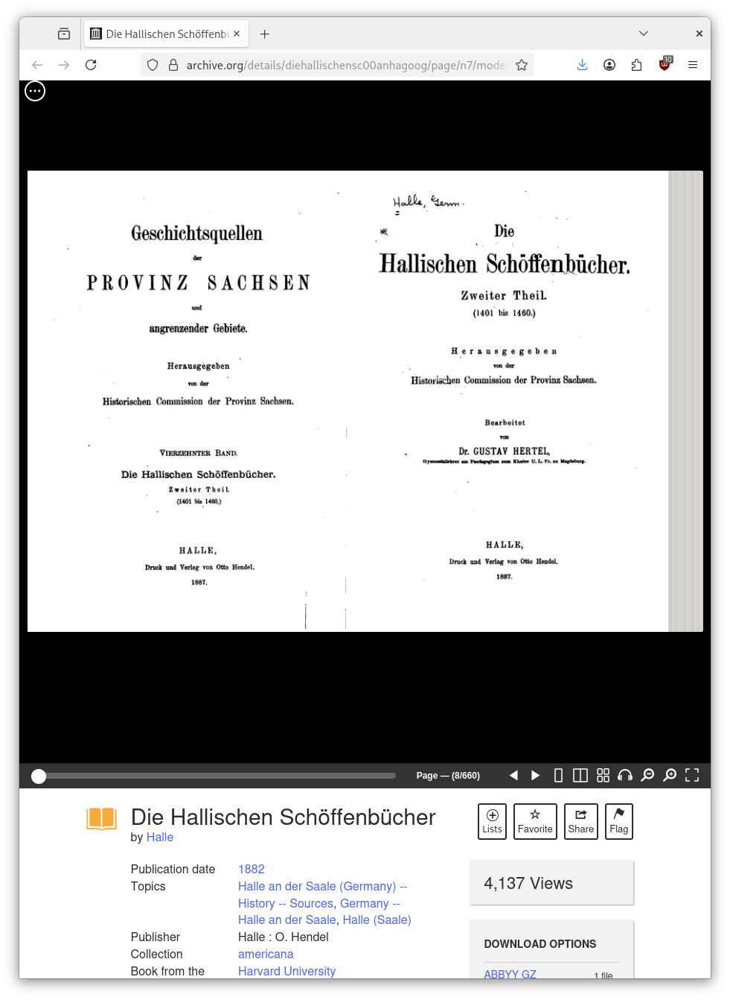
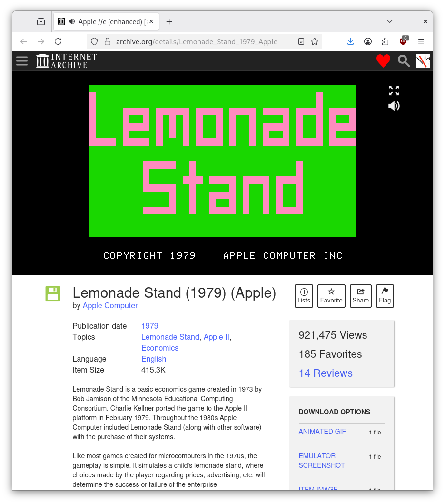
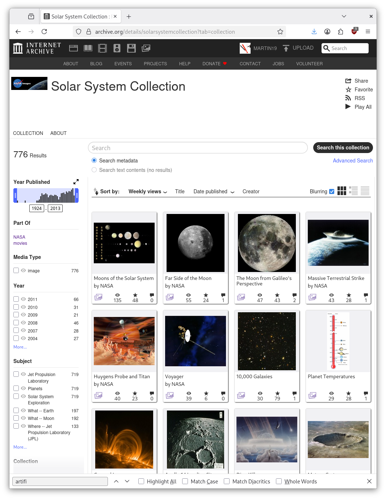
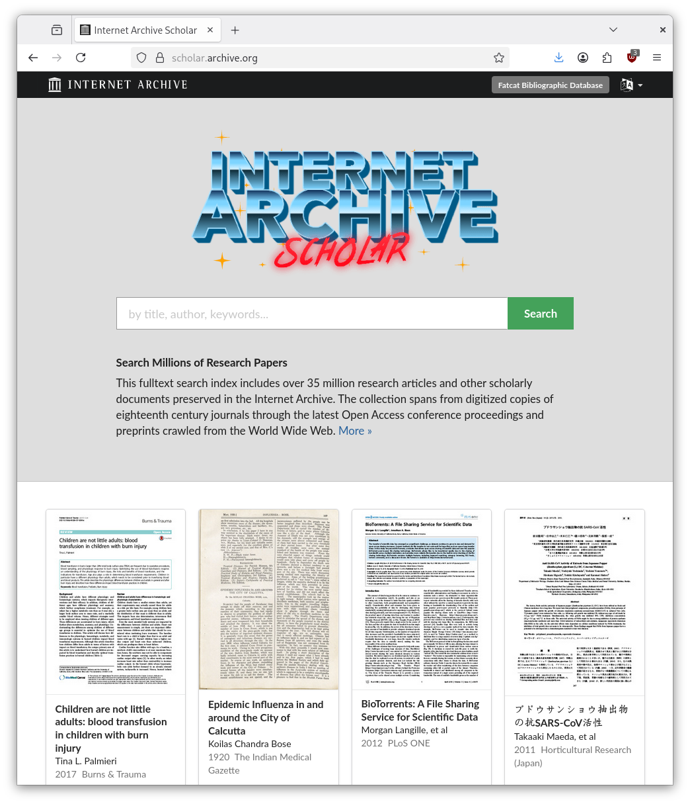

### Quick archive tour

Join me in my time machine: [mmz-halle.de](http://web.archive.org/web/20250000000000*/http://mmz-halle.de)

> [2001-10-17](http://web.archive.org/web/20011017200142/http://www.mmz-halle.de/html/mmz/ausrichtung/ausrichtung_frame.html)

> Zentrum - Entwicklungen brauchen einen Ort, an dem sie stattfinden. Auch im
> digitalen Zeitalter muss man sich treffen können, miteinander reden, planen,
> herstellen. Kreative Ideen, wissenschaftlicher Blick und praktisches Tun
> müssen sich begegnen. Das geht am besten in einem Zentrum, das geht am besten
> an einem Ort, der ausstrahlt und anzieht.

> [2011-11-09](https://web.archive.org/web/20111109214107/http://www.mmz-halle.de/)

#### Digitized books

#### Classic games

Lemonade Stand (1979)

#### Image collections

#### Scholarly material

#### Services

> We also provide services around [archiving](https://archive-it.org/) and [digitization projects](https://digitization.archive.org/projects/).

